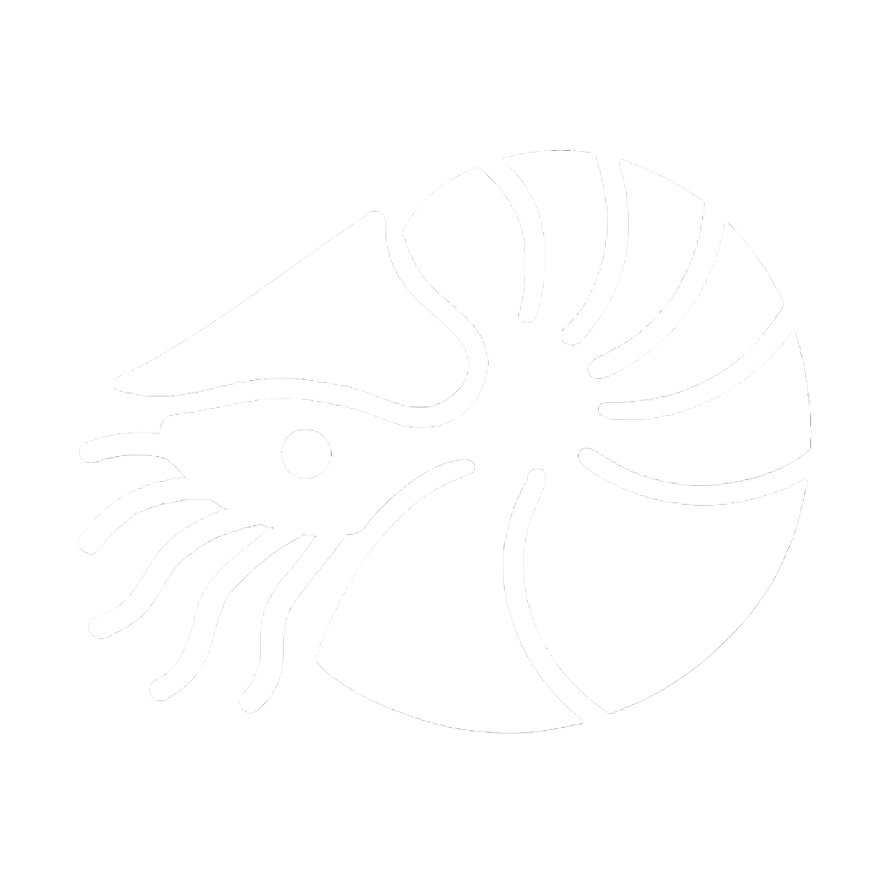
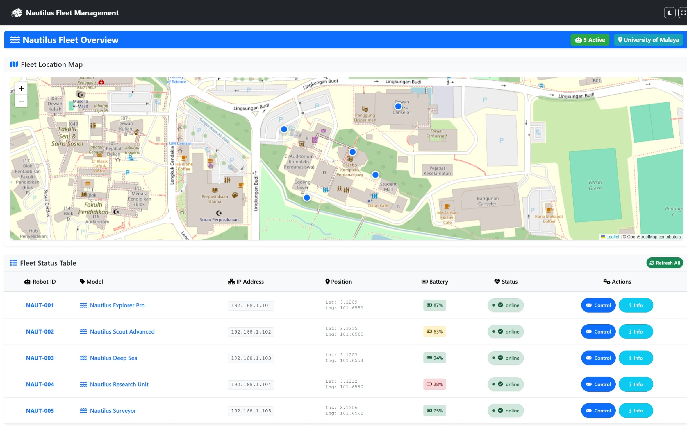
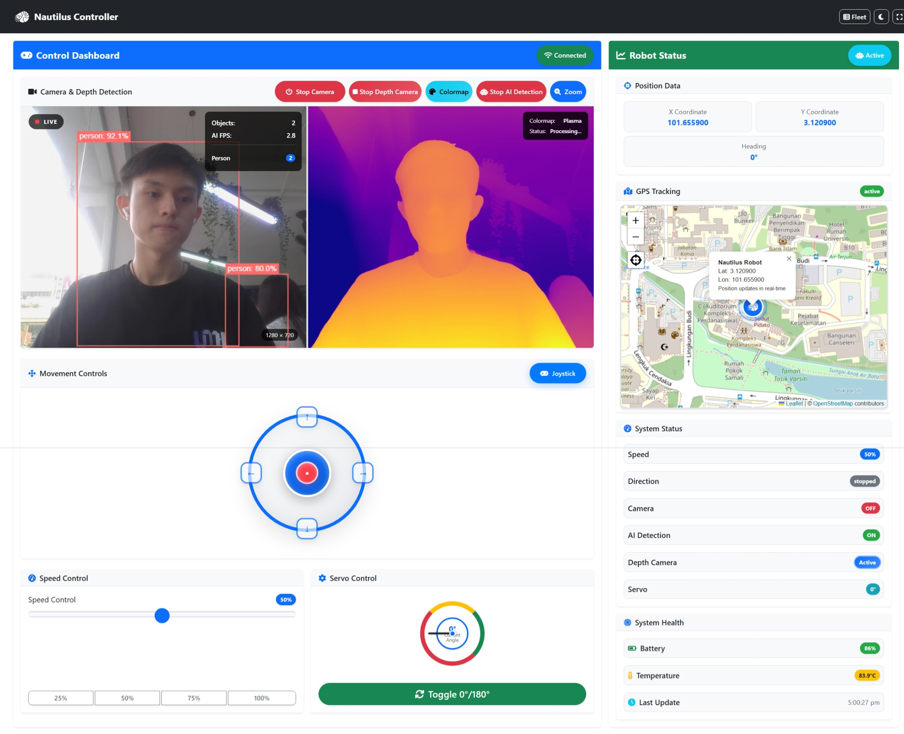
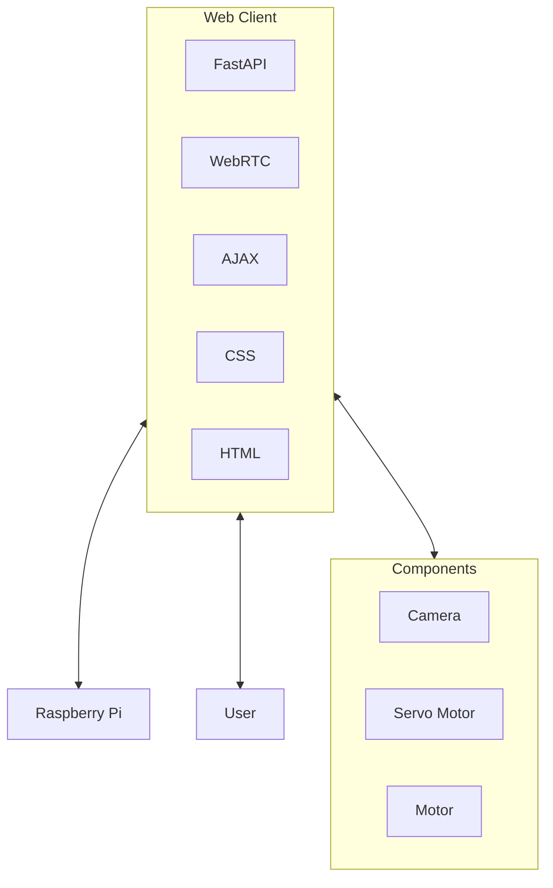

<div align="center">



# **Nautilus Controller**

**A comprehensive web client for Raspberry Pi robotics with real-time control, monitoring, and AI-powered features**

[](https://www.raspberrypi.org/)
[](https://www.python.org/)
[](https://fastapi.tiangolo.com/)
[](https://docs.openvino.ai/)
[](https://github.com/ultralytics/yolov5)

</div>

---

## 🚀 Overview

Nautilus Controller is a cutting-edge web-based control platform designed for Raspberry Pi robotics applications. It provides an intuitive, responsive interface for real-time robot control with advanced features including AI-powered detection, depth perception, and comprehensive telemetry monitoring.

<div align="center">

### 📸 Demo Screenshots

**Fleet Management Dashboard**


**Individual Robot Controller**


</div>

## ✨ Key Features

### 🏢 Fleet Management System

- **Multi-Robot Dashboard**: Monitor and control multiple Nautilus units simultaneously
- **Real-time Status Monitoring**: Live battery levels, positions, and operational status
- **Interactive Map**: Geographic visualization of robot locations with hover interactions
- **Centralized Control**: Access individual robot controllers from fleet overview
- **Status Indicators**: Color-coded status badges for quick fleet assessment
- **Responsive Design**: Mobile-optimized fleet management interface

### 🎮 Advanced Movement Controls

<details>
<summary><strong>Joystick Control System</strong> (Default Mode)</summary>

- **360° Movement**: Full directional control with 8-direction support
- **Intensity-Based Speed**: Distance from center controls movement speed
- **Touch & Mouse Compatible**: Optimized for both desktop and mobile
- **Visual Feedback**: Real-time direction and intensity indicators
- **Diagonal Movement**: Precise multi-directional navigation

</details>

<details>
<summary><strong>Traditional Button Controls</strong></summary>

- **Directional Buttons**: Forward, Backward, Left, Right movement
- **Keyboard Integration**: WASD or Arrow Keys support
- **Emergency Stop**: Large, accessible emergency stop button
- **Mode Toggle**: Seamless switching between control modes

</details>

### 📷 Camera & Vision Systems

- **Live Camera Feed**: Real-time video streaming with WebRTC
- **Depth Perception**: AI-powered depth analysis using Depth Anything V2
- **Object Detection**: Intelligent object recognition and tracking
- **Toggle Controls**: Easy camera system management

### 🔧 Hardware Control

- **Servo Motor Control**: Precise positioning (0° - 90°)
- **Variable Speed Control**: Adjustable motor speed (0-100%)
- **Quick Speed Presets**: 25%, 50%, 75%, 100% speed buttons
- **Real-time Monitoring**: Live hardware status updates

### 📊 Telemetry & Monitoring

- **Position Tracking**: Real-time X, Y coordinates and heading
- **System Status**: Speed, direction, camera status, servo position
- **Environmental Data**: Battery level, temperature monitoring
- **Connection Status**: Live connectivity indicators

### 🎨 User Experience

- **Responsive Design**: Optimized for mobile, tablet, and desktop
- **Dark/Light Themes**: Enhanced dark mode with vibrant colors
- **Fullscreen Mode**: Immersive control experience
- **Touch Controls**: Full touch support for mobile platforms
- **Real-time Updates**: 1-second status refresh intervals

---

## 🏗️ Architecture


---

## 🔧 Installation

### Quick Start

1. **Clone the Repository**
   ```bash
   git clone https://github.com/yourusername/nautilus-controller.git
   cd nautilus-controller
   ```

2. **Install Dependencies**
   ```bash
   pip install -r requirements.txt
   ```

 3. **Download AI Models**
    
    **Depth Anything V2 Model** (Manual download required):
    ```bash
    # Download Depth Anything V2 model
    wget https://huggingface.co/depth-anything/Depth-Anything-V2-Base/resolve/main/depth_anything_v2_vitb.pth
    ```
    or [Download Here](https://huggingface.co/depth-anything/Depth-Anything-V2-Base/resolve/main/depth_anything_v2_vitb.pth?download=true)

    > Put the downloaded model inside 'checkpoints' folder
    
    **YOLOv5 Models (AI Detection)**:
    - ✅ YOLOv5 models download automatically on first use
    - No manual download required
    - Models are cached locally for future use

4. **Configure Hardware** (Optional)
   ```bash
   # Enable camera interface
   sudo raspi-config
   # Navigate to Interface Options > Camera > Enable
   ```

---

## 📱 Usage

### Starting the Server

**Windows:**
```bash
cd web-client; python -m uvicorn backend:app --host 0.0.0.0 --port 8000 --reload
```

**Alternative Windows:**
```bash
cd web-client; python backend.py
```

### Accessing the Interface

**Local Access:**
```
http://localhost:8000
```

**Mobile/Remote Access:**
```
http://YOUR_PI_IP_ADDRESS:8000
```

---

## 🎮 Controls

### Keyboard Shortcuts

| Key | Function | Mode |
|-----|----------|------|
| `W` / `↑` | Move Forward | Button Mode |
| `S` / `↓` | Move Backward | Button Mode |
| `A` / `←` | Move Left | Button Mode |
| `D` / `→` | Move Right | Button Mode |
| `J` | Toggle Control Mode | All Modes |
| `C` | Toggle Camera | All Modes |
| `V` | Toggle Servo | All Modes |
| `F` | Toggle Fullscreen | All Modes |
| `X` | Toggle Depth Camera | All Modes |
| `Z` | Toggle AI Detection | All Modes |

### Control Modes

- **Joystick Mode**: Drag-based 360° movement control
- **Button Mode**: Traditional directional button controls
- **Keyboard Mode**: WASD/Arrow key navigation

---

## 🔌 API Reference

### Movement Control
```http
POST /api/move
Content-Type: application/json

{
  "direction": "forward|backward|left|right|stop",
  "speed": 0-100
}
```

### Camera Control
```http
POST /api/camera/toggle
```

### Servo Control
```http
POST /api/servo/toggle
```

### System Status
```http
GET /api/status
```

### Speed Control
```http
POST /api/speed
Content-Type: application/json

{
  "speed": 0-100
}
```

---

## 🧪 Testing

### Manual Testing Tools

**Depth Camera Testing:**
```bash
python depth_camera_comparison.py
```

**AI Detection Testing:**
```bash
python simple_webcam_detector.py
```

**Hardware Integration Testing:**
```bash
python tests/hardware_test.py
```

---

<div align="center">

**Built by  Great Wall of FSKTM**

</div>