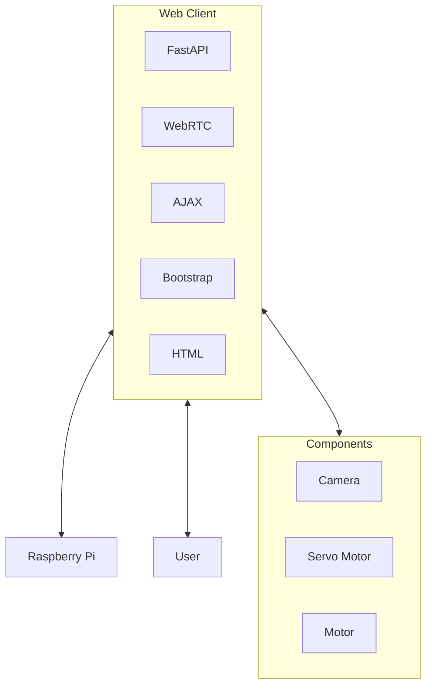

Good Morning, 

I'd like to have a server that can control the component via Raspberry Pi.

## Requirement
- UI friendly for mobile platform
- Horizontal webpage with toggleable full screen
- Button for forward, backward, left, right
- Button for toggleable camera
- Button for toggleable servo change (refer to servo-controller.py)
- Motor speed adjustment
- Information box with robot coordinate, motor speed (in %) in real time
- Pressing button does not reload the page
- A robot coordinate with Maps (optional)

## Tech Stack
- Use FastAPI as backend 
- Use AJAX (Async Javascript and XML) so pressing button doesnt reload the page
- Frontend up to you, should be light weight. BootStrap + HTML should be enough

## What is servo-controller.py?
It's for controlling servo (duh) with a toggleable degree of 0 to 90 degree.

> If you want, you can try to play implement the button with servo controller code. 

## Note 
- Any library imported to python file should be included in requirements.txt



# Nautilus Controller - Setup and Usage

## Installation

1. Install the required dependencies:
```bash
pip install -r requirements.txt
```

## Running the Application

1. Start the FastAPI server:
```bash
python main.py
```

2. Open your web browser and navigate to:
```
http://localhost:8000
```

For mobile devices on the same network, use your computer's IP address:
```
http://YOUR_IP_ADDRESS:8000
```

## Features

### Movement Controls
- **Arrow Buttons**: Forward, Backward, Left, Right movement
- **Stop Button**: Emergency stop
- **Keyboard Controls**: WASD or Arrow Keys for movement, Space to stop

### Camera Control
- **Toggle Camera**: Turn camera feed on/off
- **Keyboard Shortcut**: Press 'C' to toggle camera

### Servo Control
- **Toggle Servo**: Switch between 0° and 90° positions
- **Keyboard Shortcut**: Press 'V' to toggle servo

### Speed Control
- **Speed Slider**: Adjust motor speed from 0-100%
- **Quick Speed Buttons**: 25%, 50%, 75%, 100%

### Real-time Information
- **Position**: X, Y coordinates and heading
- **System Status**: Current speed, direction, camera status, servo position
- **System Info**: Battery level, temperature, last update time
- **Connection Status**: Shows if connected to the robot

### Additional Features
- **Fullscreen Mode**: Press 'F' or click the fullscreen button
- **Mobile Responsive**: Optimized for mobile devices
- **Touch Controls**: Full touch support for mobile platforms
- **Real-time Updates**: Status updates every second

## Keyboard Shortcuts

| Key | Action |
|-----|--------|
| W / ↑ | Move Forward |
| S / ↓ | Move Backward |
| A / ← | Move Left |
| D / → | Move Right |
| Space | Stop |
| C | Toggle Camera |
| V | Toggle Servo |
| F | Toggle Fullscreen |

## API Endpoints

- `GET /` - Main controller interface
- `POST /api/move` - Move robot in specified direction
- `POST /api/stop` - Stop robot movement
- `POST /api/servo/toggle` - Toggle servo position
- `POST /api/camera/toggle` - Toggle camera on/off
- `POST /api/speed` - Set motor speed
- `GET /api/status` - Get current robot status

## Mock Data

The current implementation uses mock data for demonstration purposes. The following components are simulated:
- Robot position and movement
- Camera feed status
- Servo position
- Battery level and temperature
- System status updates

## Integration with Real Hardware

To integrate with actual Raspberry Pi hardware:

1. Replace mock functions in `main.py` with actual hardware control code
2. Integrate with the existing `servo-controller.py` for servo control
3. Add camera streaming functionality (WebRTC or similar)
4. Implement actual motor control functions
5. Add real sensor data collection

### Development Mode

For development with auto-reload:
```bash
uvicorn main:app --reload --host 0.0.0.0 --port 8000
```
