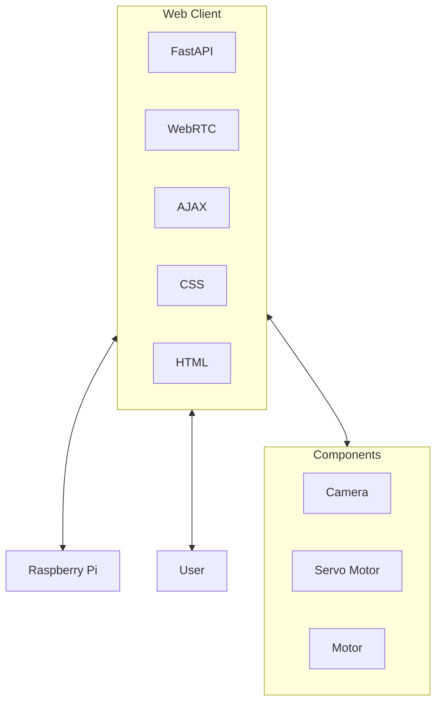

# Nautilus Controller
Nautilus Controller is a web client for Raspberry Pi to be able to be controlled by users.

## Features

### Movement Controls
- **Joystick Control** (Default): Mobile-friendly joystick with 360° movement
  - Supports diagonal movement (8 directions)
  - Touch and mouse compatible
  - Visual feedback with direction indicators
  - Intensity-based movement (distance from center affects speed)
- **Traditional Buttons**: Forward, Backward, Left, Right movement buttons
- **Control Mode Toggle**: Switch between joystick and button controls
- **Emergency Stop**: Large, accessible emergency stop button
- **Keyboard Controls**: WASD or Arrow Keys for movement (in button mode), Space to stop

### Camera Control
- **Toggle Camera**: Turn camera feed on/off
- **Keyboard Shortcut**: Press 'C' to toggle camera

### Servo Control
- **Toggle Servo**: Switch between 0° and 90° positions
- **Keyboard Shortcut**: Press 'V' to toggle servo

### Speed Control
- **Speed Slider**: Adjust motor speed from 0-100%
- **Quick Speed Buttons**: 25%, 50%, 75%, 100%

### Real-time Information
- **Position**: X, Y coordinates and heading
- **System Status**: Current speed, direction, camera status, servo position
- **System Info**: Battery level, temperature, last update time
- **Connection Status**: Shows if connected to the robot

### Additional Features
- **Dual Control Modes**: Joystick (mobile-optimized) and traditional buttons
- **Enhanced Mobile Support**: Optimized joystick controls for touch devices
- **Diagonal Movement**: 8-directional movement with intensity control
- **Fullscreen Mode**: Press 'F' or click the fullscreen button
- **Mobile Responsive**: Optimized for mobile devices with adaptive layouts
- **Touch Controls**: Full touch support for mobile platforms
- **Real-time Updates**: Status updates every second
- **Dark/Light Theme**: Automatic theme switching with manual toggle

## Keyboard Shortcuts

| Key | Action |
|-----|--------|
| W / ↑ | Move Forward (button mode only) |
| S / ↓ | Move Backward (button mode only) |
| A / ← | Move Left (button mode only) |
| D / → | Move Right (button mode only) |
| J | Toggle Joystick/Button Controls |
| C | Toggle Camera |
| V | Toggle Servo |
| F | Toggle Fullscreen |
| Z | Toggle AI Detection |

## Architecture Overview

## Installation

1. Install the required dependencies:
```bash
pip install -r requirements.txt
```

## Running the Application

1. Start the FastAPI server (Linux/Ubuntu):
```bash
sudo python3 main.py
```
or (Windows)

```bash
cd web-client; python -m uvicorn backend:app --host 0.0.0.0 --port 8000 --reload
```
or (Windows)

```bash
cd web-client; python backend.py
```
2. Download the model: [Depth Anything](https://huggingface.co/depth-anything/Depth-Anything-V2-Base/resolve/main/depth_anything_v2_vitb.pth?download=true)

3. Open your web browser and navigate to:
```
http://localhost:8000
```

For mobile devices on the same network, use your computer's IP address:
```
http://YOUR_IP_ADDRESS:8000
```

## Testing Functionality

```bash
#Depth model Window
python depth_camera_comparison.py

#AI Detector Window
python simple_webcam_detector.py
```

## API Endpoints

- `GET /api/status` - Get current robot status
- `GET /` - Main controller interface
- `POST /api/move` - Move robot in specified direction
- `POST /api/stop` - Stop robot movement
- `POST /api/servo/toggle` - Toggle servo position
- `POST /api/camera/toggle` - Toggle camera on/off
- `POST /api/speed` - Set motor speed


## Mock Data

The current implementation uses mock data for demonstration purposes. The following components are simulated:
- Robot position and movement
- Camera feed status
- Servo position
- Battery level and temperature
- System status updates


## To Dos
- [X] UI friendly for mobile platform
- [ ] Horizontal webpage with toggleable full screen
- [X] Button for forward, backward, left, right
- [X] Button for toggleable camera
- [X] Button for toggleable servo change (refer to servo-controller.py)
- [X] Motor speed adjustment
- [X] Information box with robot coordinate, motor speed (in %) in real time
- [X] Pressing button does not reload the page
- [ ] A robot coordinate with Maps (optional)
- [ ] Replace mock functions in `main.py` with actual hardware control code
- [X] Integrate with the existing `servo-controller.py` for servo control
- [ ] Add camera streaming functionality (WebRTC or similar)
- [ ] Implement actual motor control functions
- [ ] Add real sensor data collection

