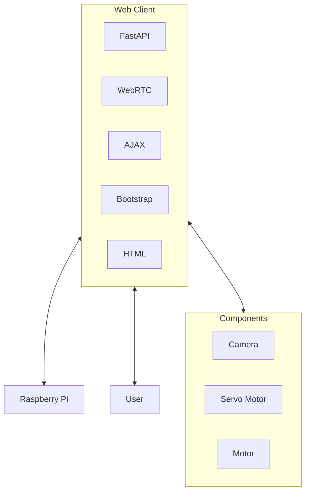

Good Morning, 

I'd like to have a server that can control the component via Raspberry Pi.

## Requirement
- UI friendly for mobile platform
- Horizontal webpage with toggleable full screen
- Button for forward, backward, left, right
- Button for toggleable camera
- Button for toggleable servo change (refer to servo-controller.py)
- Motor speed adjustment
- Information box with robot coordinate, motor speed (in %) in real time
- Pressing button does not reload the page
- A robot coordinate with Maps (optional)

## Tech Stack
- Use FastAPI as backend 
- Use AJAX (Async Javascript and XML) so pressing button doesnt reload the page
- Frontend up to you, should be light weight. BootStrap + HTML should be enough

## What is servo-controller.py?
It's for controlling servo (duh) with a toggleable degree of 0 to 90 degree.

> If you want, you can try to play implement the button with servo controller code. 

## Note 
- Any library imported to python file should be included in requirements.txt

